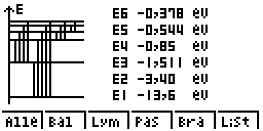
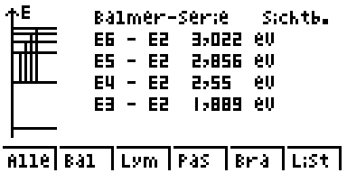
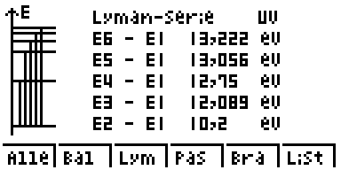
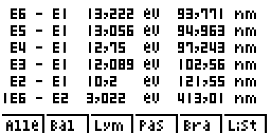

# casio_hydrogen_energy_diagram only for Casio fx-9860 GIII or GII 
a simple casio Add-In for displaying the energy diagramms for hydrogen

## Installation

Connect Casio fx-9860 GIII or GII to your Computer with the help of the USB cable. 
Press [F1] 
 
Open the file manager of your operating system and insert the ETSH2.G1A file into  
the shown device (usually D:). 
 
Eject device (usually D:). More info on calculator display. 
 
Press [EXE] as shown on the screen. 
Press [EXIT] as shown on the screen. 
Press [MENU] as shown on the screen. 
 

## Use

Open ETSH2 by scrolling to the symbol and pressing [EXE]. 
 

## Screenshots

## Menu

Choose between six different menus

show all series [F1]

show Balmer-Series [F2]

show Lyman-Series [F3]

show Paschen-Series [F4]

show brackett-Series [F5]

show list of all energy differences fith corresponding wavelength [F6]

## Changelog

### V1.0.0
initial version

## License

GPL-3.0 license
